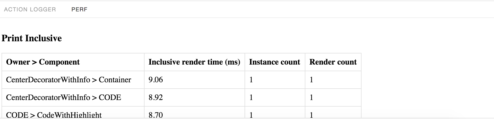

# Storybook Addon Perf

Storybook Addon Perf allows you to debug your react components in [Storybook](https://storybook.js.org).

This addon works with Storybook for:
[React](https://github.com/storybooks/storybook/tree/master/app/react).



### Getting Started

```sh
npm i --save-dev react-addons-perf storybook-addon-perf
```

Then create a file called `addons.js` in your storybook config.

Add following content to it:

```js
import 'storybook-addon-perf/register';
```

Then write your stories like this:

```js
import React from 'react';

import { storiesOf } from '@storybook/react';
import { WithPerf } from 'storybook-addon-perf';

import Component from './Component';

storiesOf('Component', module)
  .add('with some feature', () => (
    <WithPerf>
      <Component></Component>
    </WithPerf>
  ));
```
